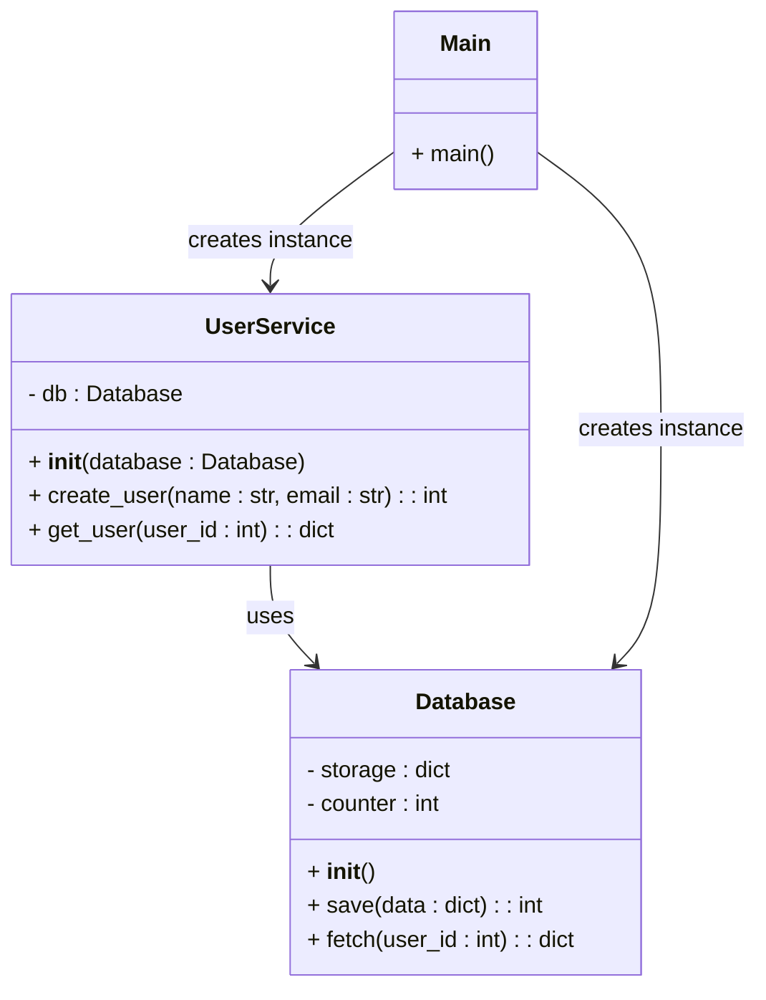

```mermaid
classDiagram
    class UserService {
        - db : Database
        + __init__(database : Database)
        + create_user(name : str, email : str) : int
        + get_user(user_id : int) : dict
    }

    class Database {
        - storage : dict
        - counter : int
        + __init__()
        + save(data : dict) : int
        + fetch(user_id : int) : dict
    }

    class Main {
        + main()
    }

    UserService --> Database : uses
    Main --> UserService : creates instance
    Main --> Database : creates instance
```